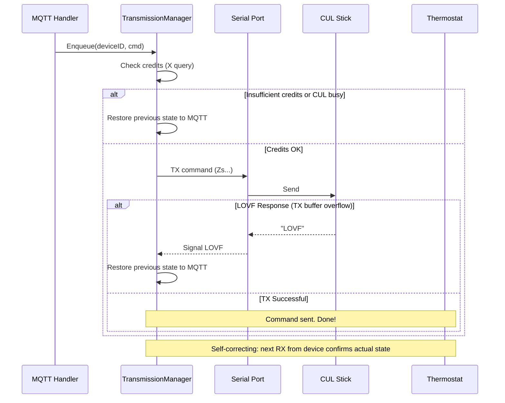

# MAX! to MQTT Bridge

A Go-based bridge connecting a CUL-USB stick (868MHz MAX! protocol) to Home Assistant via MQTT.
Designed to replace legacy FHEM installations with a lightweight, standalone service.

## Features

-   **Serial Communication**: Reads `Z` telegrams from CUL-FW compatible sticks.
-   **MAX! Protocol Parsing**: Decodes Temperature, Mode, and Battery State.
    -   **Detailed Support**:
            -   **Thermostat Status**:
                -   **Accepted**: Wall Thermostats (Type `0x70`, `0x42`) and extended Acks (Type `0x02` w/ Actual Temp).
                -   **Ignored**: Radiator Thermostats (Type `0x60`) and standard Acks to prevent duplicate/partial data.
            -   **Payload**: Mode, Setpoint, and Actual Temperature.
-   **Time Synchronization**: Automatically syncs time (Type `0x03`) with devices:
    -   On startup: broadcasts to all devices (after 10 second delay)
    -   After pairing: sends directly to the newly paired device
    -   On device request: responds when a device sends a TimeInformation request
    -   Every 24 hours: broadcasts to all devices to keep clocks accurate
-   **Home Assistant Integration**:
    -   **Auto-Discovery**: Fully compliant with HA MQTT Discovery (Climate, Number, Select, Binary Sensor).
    -   **Entities**:
        -   **Climate**: Thermostat control with support for `temperature` (setpoint), `current_temperature` (actual), `hvac_action` (heating/idle), and `hvac_mode` (auto/heat/off).
        -   **Number**: Configuration entities for Eco and Comfort temperatures.
        -   **Select**: Display Mode selector for Wall Thermostats (Setpoint/Actual).
        -   **Binary Sensor**: Battery status (OK/Low).
    -   **Pairing Mode**: Trigger via MQTT (`max/bridge/pair`) to pair new devices.
    -   **Retained Messages**: All MQTT messages (discovery and state) are published with the `retain` flag. This ensures Home Assistant keeps entities and their last known values across bridge or HA restarts.
    -   **Default State**: Newly discovered devices without explicit mode information default to `heat` mode to avoid "Invalid mode" errors in Home Assistant.
-   **Duty Cycle Management**: 
    -   Adheres to 868MHz 1% transmission limits using CUL's credit system.
    -   Before each TX: queries CUL credits and queue status (`X` command).
    -   Only transmits if queue is empty (0) and credits >= minimum threshold.
    -   Commands are queued internally and processed sequentially.
    -   **Fail-fast design**: If a command cannot be sent (insufficient credits or CUL busy), it is immediately discarded without retry. The previous MQTT state is restored to sync Home Assistant with the actual device state.
-   **TX Flow**:
    -   Detects LOVF (Limit Of Voice Full) CUL buffer overflow errors.
    -   On immediate failure (no credits, LOVF, or CUL busy): restores previous MQTT state.
    -   **Self-Correcting**: No ACK waiting—the next RX packet from the device contains its actual state, automatically fixing any discrepancy if a TX was lost.
-   **Lightweight**: Static binary built with Go, running in a minimal Alpine container.

## Queue Behavior

1. Command is dequeued from the channel
2. Credits are checked via `X` command
3. If credits < threshold or CUL queue busy → command is immediately discarded and state restored
4. Command is sent to CUL stick
5. **LOVF check**: If CUL returns "LOVF" before TX completes → restore state
6. Done! The next RX from the device will confirm/correct state if needed

Commands are "fire-and-forget" after passing the credit check. The system is self-correcting—any state mismatch (e.g., from a lost TX packet) is automatically fixed when the device next transmits its current state.

## Protocol Details

This bridge implements a strict filter to ensure high-quality data and avoid state conflicts in rooms with multiple devices.

### Supported Message Types

-   **Wall Thermostat State (`0x70`)**:
    -   **Description**: The primary status message from Wall Mounted Thermostats.
    -   **Why**: Contains the authoritative Mode, Valid Setpoint, and Battery status for the room.
-   **Wall Thermostat Control (`0x42` / `0x40`)**:
    -   **Type 0x42**: Sent when adjustments are made directly on the device (e.g., turning the wheel).
    -   **Type 0x40**: Set Temperature/Mode packet. When received from a device, it indicates a manual change (button press/wheel turn).
    -   **Why**: Accepted by the bridge to provide immediate feedback on manual changes in Home Assistant.
-   **Extended Acknowledgements (`0x02`)**:
    -   **Description**: Acks with a payload length $\ge$ 6 bytes.
    -   **Why**: These are special packets sent by Wall Thermostats that contain the **Actual Temperature** (Current Room Temp). This is the only reliable source for this data in the CUL protocol, so we dynamically detect and parse it.
-   **Radiator Thermostat State (`0x60`)**:
    -   **Description**: Periodic status updates from radiator valves.
    -   **Why**: Accepted to monitor **Battery State** and confirm receipt of commands sent directly to valves.


### Ignored Message Types

-   **Standard Acknowledgements (`0x02`)**:
    -   **Description**: Short Acks (< 6 bytes).
    -   **Reason**: Contain redundant info (Mode/Setpoint) already captured by `0x70` messages. Ignored to reduce MQTT noise.
-   **Shutter Contacts (`0x30`)**:
    -   **Reason**: Out of scope for this climate-focused bridge.

## Deployment

### Option A: Home Assistant Add-on

1.  Copy this directory to your Home Assistant `addons/local/max2mqtt` folder.
2.  Navigate to **Settings -> Add-ons -> Add-on Store -> Local** in Home Assistant.
3.  Install **MAX! to MQTT Bridge**.
4.  Configure the Serial Port and MQTT credentials in the "Configuration" tab.
5.  Start the Add-on.

### Option B: Standalone Docker

```bash
# Build the image
docker build -t max2mqtt .

# Run the container
docker run -d \
  --device=/dev/ttyACM0 \
  -e MQTT_BROKER=tcp://192.168.1.10:1883 \
  -e SERIAL_PORT=/dev/ttyACM0 \
  max2mqtt
```

## Configuration Options

| Environment Variable | JSON Option | Default | Description |
|---------------------|-------------|---------|-------------|
| `SERIAL_PORT` | `serial_port` | `/dev/serial/by-id/usb-SHK_NANO_CUL_868-if00-port0` | Path to CUL stick |
| `BAUD_RATE` | `baud_rate` | `38400` | Serial baud rate |
| `MQTT_BROKER` | `mqtt_broker` | `tcp://homeassistant:1883` | MQTT Broker URL |
| `MQTT_USER` | `mqtt_user` | (empty) | MQTT Username |
| `MQTT_PASS` | `mqtt_pass` | (empty) | MQTT Password |
| `GATEWAY_ID` | `gateway_id` | `123456` | Gateway Hex ID (3 bytes) |
| `LOG_LEVEL` | `log_level` | `info` | Log verbosity (debug/info) |
| `DUTY_CYCLE_MIN_CREDITS` | `duty_cycle_min_credits` | `100` | Min credits to allow sending |
| `COMMAND_TIMEOUT` | `command_timeout` | `1m` | Max time a command waits in queue before being discarded due to duty cycle limits |

> **Note on Configuration:**
> *   **Home Assistant Add-on:** The application automatically reads configuration from `/data/options.json`. This file is generated by the Home Assistant Supervisor at runtime based on the values defined in `config.yaml`.
> *   **Standalone / Docker:** Configuration via Environment Variables takes precedence if `/data/options.json` is not found.

## Finding your Serial Port

On Linux, it is recommended to use the persistent `by-id` path so the device remains found even after reboots or unplugging.

Run this command:
```bash
ls -l /dev/serial/by-id/
```

You should see something like:
`usb-busware.de_CUL868-if00 -> ../../ttyACM0`
Or for a Nano CUL:
`usb-SHK_NANO_CUL_868-if00-port0 -> ../../ttyUSB0`

Use the full path in your config:
`/dev/serial/by-id/usb-SHK_NANO_CUL_868-if00-port0`

## Pairing New Devices

To pair a new MAX! device:
1.  Put the device in pairing mode (usually by holding the boost button).
2.  Trigger the bridge's pairing mode by sending a message to `max/bridge/pair` (payload ignored).

    **Option A: Via Home Assistant UI (Easiest)**
    1. Go to **Settings** -> **Devices & Services**.
    2. Find the **MQTT** integration and click **Configure**.
    3. Under "Publish a packet":
       - Topic: `max/bridge/pair`
       - Payload: `on`
       - Click **Publish**.

    **Option B: Via Command Line**
    ```bash
    mosquitto_pub -h homeassistant -t max/bridge/pair -m "on"
    ```
3.  The bridge will respond to pairing requests for 60 seconds.

## Device Configuration

After pairing devices, you can configure additional settings directly from Home Assistant.

### Eco/Comfort Temperature

Each thermostat exposes two Number entities for configuring the eco and comfort preset temperatures:

- **Eco Temperature**: The temperature used when eco mode is activated (default: 17.0°C)
- **Comfort Temperature**: The temperature used when comfort mode is activated (default: 21.0°C)

> **⚠️ Important**: Don't set too many values in a short time. This could consume too many credits and block the bridge for a while.

When changing these values, max2mqtt preserves the device's current configuration for other settings (max/min temperature, measurement offset, window open settings). On first use, sensible defaults are applied since the actual device config cannot be read via the CUL protocol.

### Display Mode (Wall Thermostats Only)

Wall thermostats can display either the **target/setpoint temperature** or the **actual measured temperature**. A dropdown selector is provided with two options:

- **Setpoint**: Display shows target temperature
- **Actual**: Display shows measured room temperature

> **Note**: This setting appears for all devices but only affects Wall Thermostats. Radiator thermostats will ignore this command.

### Device Association (Linking Devices)

You can link MAX! devices together so they work as a team. For example, linking a **radiator thermostat** with a **wall thermostat** allows the wall thermostat to control the radiator valve based on the room temperature it measures.

> **Important**: Association must be done **in both directions**. Each device needs to know about the other.

**Partner Type Values:**
| Type | Device |
|------|--------|
| 1 | Heating Thermostat (radiator valve) |
| 2 | Heating Thermostat Plus |
| 3 | Wall Mounted Thermostat |
| 4 | Shutter Contact |
| 5 | Push Button |

**Example: Link radiator `0A1B2C` with wall thermostat `0D3E4F`:**

```bash
# Step 1: Tell the radiator about the wall thermostat (type 3)
mosquitto_pub -h homeassistant -t "max/0A1B2C/associate" -m "0D3E4F:3"

# Step 2: Tell the wall thermostat about the radiator (type 1)
mosquitto_pub -h homeassistant -t "max/0D3E4F/associate" -m "0A1B2C:1"
```

Or via **Home Assistant Developer Tools → Services → MQTT: Publish**:
| Field | Value |
|-------|-------|
| Topic | `max/0A1B2C/associate` |
| Payload | `0D3E4F:3` |

> **Note**: If you omit the partner type (e.g., just `0D3E4F`), it defaults to type 1 (radiator thermostat).

## Configuration
### Watchdog and restart
There is no watchdog endpoint configured in the addon nor there is a healtcheck configured in Dockerfile. So, we only rely on the containers Exited state, which signals that the main process (PID 1) of the container has died. If you want to automatically restart the addonin such case, then activate the Watchdog button on the Addon information page.

## Development

The project is written in Go. To build locally:

```bash
go mod download
go build -o max2mqtt .
```

### Cross-Compilation for Linux

If you are building on macOS/Windows for a Linux host (e.g., Raspberry Pi or Debian Server):

**For Standard Linux (AMD64/x86_64):**
```bash
CGO_ENABLED=0 GOOS=linux GOARCH=amd64 go build -ldflags="-w -s" -o max2mqtt-linux-amd64 .
```

**For Raspberry Pi 3/4/5 (64-bit ARM / aarch64):**
```bash
CGO_ENABLED=0 GOOS=linux GOARCH=arm64 go build -ldflags="-w -s" -o max2mqtt-linux-arm64 .
```

**For Older Raspberry Pi / 32-bit OS (ARMv7 / armv7l):**
```bash
CGO_ENABLED=0 GOOS=linux GOARCH=arm GOARM=7 go build -ldflags="-w -s" -o max2mqtt-linux-armv7 .
```

## Status

- **Reading/Parsing**: Stable. Validated against real-world data for both Radiator and Wall Thermostats.
- **Writing (Control)**: Implemented. 
  - **Temperature**: Sends Type `0x40` with Target Temp while preserving the current mode (Auto/Manual/Boost).
  - **Mode**: Supports Auto, Heat (Manual), Off (Manual 4.5°C), and Boost.
  - **Smart Filtering**: Processes key packet types for state updates.
- **Duty Cycle**: Pre-TX credit and queue check via 'X' command. TX blocked if queue busy or credits insufficient.
- **TX Flow**: Fire-and-forget after credit check. Handles LOVF errors. Self-correcting via future RX packets.

## Troubleshooting

### "Invalid modes mode" Warning in Home Assistant

If you see warnings like `Invalid modes mode: ` in Home Assistant logs:
1. This occurs when a device is discovered via a packet that doesn't contain mode information (e.g., a simple button press or wall thermostat control packet).
2. The bridge now initializes such devices with a default mode of `heat` (Manual) to prevent this error.
3. If the warning persists, restart the bridge to ensure the new default templates are applied to Home Assistant via MQTT discovery.

This means that after restarting the addon in HA, the mode of the device will be set to `heat` (Manual). When you want to have the Auto mode back, then you need to change the mode in Home Assistant.

## TX Flow

The bridge implements a fire-and-forget TX model:



**Key behaviors:**
- **LOVF Detection**: If CUL returns "LOVF" (Limit Of Voice Full), the TX is aborted and state is restored.
- **Fire-and-Forget**: After successful TX, the dispatcher moves on immediately. No ACK waiting.
- **Self-Correcting**: The next RX packet from the device always contains its current setpoint. Any mismatch (e.g., from a lost TX) is automatically corrected.
