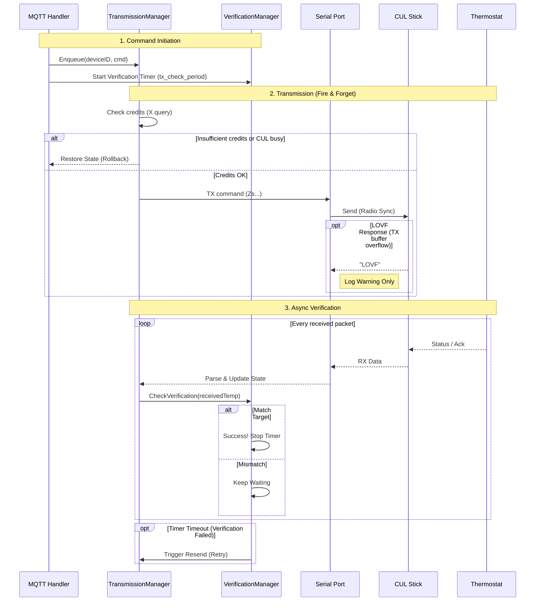

# Details of MAX! to MQTT Bridge for Home Assistant

## Time Synchronization

The bridge automatically syncs time (Type `0x03`) with devices:
-   On startup: broadcasts to all devices (after some delay)
-   After pairing: sends directly to the newly paired device
-   On device request: responds when a device sends a TimeInformation request
-   Every 1 hour: broadcasts to all devices to keep clocks accurate

## Duty Cycle and Buffer Management

The bridge adheres to 868MHz 1% transmission limits using CUL's credit system.
-   Before each TX: queries CUL credits and queue status (`X` command).
-   Only transmits if queue is below and credits are above configurable thresholds.
-   Commands are queued internally and processed sequentially. If a command cannot be sent (insufficient credits or CUL busy), it is immediately discarded without retry. The previous MQTT state is restored to sync Home Assistant with the actual device state.

## Detailed Queue Behavior

1. Command is dequeued from the channel
2. Credits are checked via `X` command
3. If credits < threshold or CUL queue busy → command is immediately discarded and state restored
4. Command is sent to CUL stick
5. LOVF check: If CUL returns "LOVF", log warning only and recommend to increase the credit threshold
6. Done! The next RX from the device will confirm/correct state if needed

Commands are "fire-and-forget" after passing the credit check. The system is self-correcting—any state mismatch (e.g., from a lost TX packet) is automatically fixed when the device next transmits its current state.

## Set Temperature Verification

To improve reliability for "Set Temperature" commands (Type `0x40`), a verification mechanism is implemented:

1.  **Tracking**: When a set temperature command is sent, the bridge starts tracking the expected value for that device.
2.  **Verification**: Every incoming status packet (`0x70`, `0x40`, `0x02`, etc.) from the device is checked:
    -   If the reported temperature matches the expected value, the verification is marked successful.
    -   If the reported temperature *differs*, the system continues waiting.
3.  **Timeout & Retry**: If no matching confirmation is received within the configured `TX_CHECK_PERIOD` (default 1 minute), the command is considered failed (e.g., lost packet) and is automatically resent once.
4.  **Priority**: If a user manually changes the temperature on the device immediately after an MQTT command, the verification logic sees a mismatch. It will wait for the `TX_CHECK_PERIOD` to expire and then automatically resend the MQTT command to enforce the requested value (as the verification target is always the last sent command).

## TX Flow Diagram



## Protocol Details

This bridge implements the following filter of message types.

**Disclaimer**: The MAX! protocol is not public and the following information is based on reverse engineering done by AI. So I can't really say for sure if this is correct.

### Supported Message Types

-   **Wall Thermostat State (`0x70`)**:
    -   **Description**: The primary status message from Wall Mounted Thermostats.
    -   **Why**: Contains the authoritative Mode, Valid Setpoint, and Battery status for the room.
-   **Wall Thermostat Control (`0x42` / `0x40`)**:
    -   **Type 0x42**: Sent when adjustments are made directly on the device (e.g., turning the wheel).
    -   **Type 0x40**: Set Temperature/Mode packet. When received from a device, it indicates a manual change (button press/wheel turn).
    -   **Why**: Accepted by the bridge to provide immediate feedback on manual changes in Home Assistant.
-   **Acknowledgements (`0x02`)**:
    -   **Description**: Acks with a payload length $\ge$ 4 bytes.
    -   **Why**: Provides immediate confirmation of Mode and Setpoint changes. Packets with length $\ge$ 6 bytes also contain the Actual Temperature.
-   **Radiator Thermostat State (`0x60`)**:
    -   **Description**: Periodic status updates from radiator valves.
    -   **Why**: Accepted to monitor Battery State and confirm receipt of commands sent directly to valves.


### Ignored Message Types

-   **Short Acknowledgements (`0x02`)**:
    -   **Description**: Malformed or very short Acks (< 4 bytes).
    -   **Reason**: Contain insufficient data to be useful.
-   **Shutter Contacts (`0x30`)**:
    -   **Reason**: Out of scope for this climate-focused bridge.

## Device Configuration

After pairing devices, you can configure additional settings directly from Home Assistant.

### Eco/Comfort Temperature

Each thermostat exposes two Number entities for configuring the eco and comfort preset temperatures:

- **Eco Temperature**: The temperature used when eco mode is activated (default: 17.0°C)
- **Comfort Temperature**: The temperature used when comfort mode is activated (default: 21.0°C)

> **⚠️ Important**: Don't set too many values in a short time. This could consume too many credits and block the bridge for a while.

When changing these values, max2mqtt preserves the device's current configuration for other settings. On first use, sensible defaults are applied since the actual device config cannot be read via the CUL protocol.

### Display Mode (Wall Thermostats Only)

Wall thermostats can display either the **target/setpoint temperature** or the **actual measured temperature**. A dropdown selector is provided with two options:

- **Setpoint**: Display shows target temperature
- **Actual**: Display shows measured room temperature

> **Note**: This setting appears for all devices but only affects Wall Thermostats. Radiator thermostats will ignore this command.

### Mode

The bridge initializes new devices or existing devices after a restart with a default mode of `heat` (Manual) to have a known state.
This means that after restarting the add-on in Home Assistant, the mode of the device will be set to `heat` (Manual). When you want to have the Auto mode back, then you need to change the mode in the Home Assistant UI.

## Add-on Configuration

### Watchdog and restart

There is no watchdog endpoint configured in the addon nor there is a healtcheck configured in Dockerfile. So, we only rely on the containers Exited state, which signals that the main process (PID 1) of the container has died. If you want to automatically restart the add-on in such case, then activate the Watchdog button on the Add-on information page.

### Finding your Serial Port

On Linux, it is recommended to use the persistent `by-id` path so the device remains found even after reboots or unplugging.

Run this command:
```bash
ls -l /dev/serial/by-id/
```

You should see something like:
`usb-busware.de_CUL868-if00 -> ../../ttyACM0`
Or for a Nano CUL:
`usb-SHK_NANO_CUL_868-if00-port0 -> ../../ttyUSB0`

Use the full path in your config:
`/dev/serial/by-id/usb-SHK_NANO_CUL_868-if00-port0`

## Troubleshooting

### LOVF Error

If you see a LOVF error in the logs, it means that the CUL stick is full and cannot accept any more commands. The bridge only logs a warning and does not restore any former state nor does it stop sending commands. This is an indicator to better increase the credit threshold configuration parameter "duty_cycle_min_credits". 

## Standalone Docker Deployment

```bash
# Build the image
docker build -t max2mqtt .

# Run the container
docker run -d \
  --device=/dev/ttyACM0 \
  -e MQTT_BROKER=tcp://192.168.1.10:1883 \
  -e SERIAL_PORT=/dev/ttyACM0 \
  max2mqtt
```
The parameter "--device /dev/ttyACM0" is the correct flag to pass a hardware device from the host system into the container.
Consistency: If you are setting the environment variable -e SERIAL_PORT=/dev/ttyACM0 two lines later, then you must explicitly expose that device node to the container so the application can access it.
Also see the configuration section in Readme for the full list of environment variables.

## Development

The project is written in Go. To build locally:

```bash
go mod download
go build -o max2mqtt .
```

### Cross-Compilation for Linux

If you are building on macOS/Windows for a Linux host (e.g., Raspberry Pi or Debian Server):

**For Standard Linux (AMD64/x86_64):**
```bash
CGO_ENABLED=0 GOOS=linux GOARCH=amd64 go build -ldflags="-w -s" -o max2mqtt-linux-amd64 .
```

**For Raspberry Pi 3/4/5 (64-bit ARM / aarch64):**
```bash
CGO_ENABLED=0 GOOS=linux GOARCH=arm64 go build -ldflags="-w -s" -o max2mqtt-linux-arm64 .
```

**For Older Raspberry Pi / 32-bit OS (ARMv7 / armv7l):**
```bash
CGO_ENABLED=0 GOOS=linux GOARCH=arm GOARM=7 go build -ldflags="-w -s" -o max2mqtt-linux-armv7 .
```

## Testing

The `test` directory contains configuration files and scripts to help verify the reliability of the bridge, specifically for thermostat operations within Home Assistant.

### Thermostat Setpoint Test

A comprehensive test script is provided to verify that "Set Temperature" commands are correctly applied to your thermostats over a longer period. This is useful for checking connection reliability and the bridge's verification logic.

The test setup consists of two parts:

#### 1. Input Helpers (`test/input_helpers.yaml`)

This file defines the necessary helpers to track the test state and statistics.
Add the contents of `test/input_helpers.yaml` to your Home Assistant `configuration.yaml` file:
*Note: You must restart Home Assistant after adding these helpers.*

#### 2. Test Script (`test/thermostat_test_script.yaml`)

This script runs the actual test logic. It performs the following actions:
-   Runs for a configurable duration (default: 1 hour).
-   In each cycle, it sets a random temperature (between 16°C and 25°C) for two configured thermostats.
-   Waits for a propagation delay (default: 120s) to allow the command to reach the device and the device to report back its new state.
-   Verifies if the reported temperature matches the setpoint.
-   Increments success/failure counters and sends notifications on failure or completion.

#### Setup Instructions

1.  Open `test/thermostat_test_script.yaml`.
2.  **Configure the variables** at the top of the file:
    -   `thermostat_1` and `thermostat_2`: Replace with your actual thermostat entity IDs (e.g., `climate.wall_thermostat_living_room`).
    -   `wait_seconds`: Adjust if you need more or less time for propagation.
3.  Copy the entire content into your Home Assistant `scripts.yaml` file (or append it if you already have scripts).
4.  Reload Scripts in Home Assistant (Developer Tools -> YAML -> Scripts).

#### Running the Test

trigger the script `script.thermostat_setpoint_test` via Developer Tools > Services or create a button in your dashboard.

#### Monitoring

-   You can watch the counters `counter.thermostat_test_success` and `counter.thermostat_test_failure` in real-time.
-   The `input_boolean.thermostat_test_running` will be `on` while the test is active.
-   You will receive a persistent notification in Home Assistant upon test completion or if a specific check fails.
